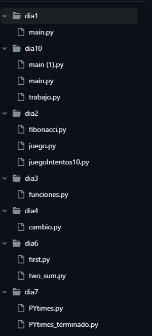
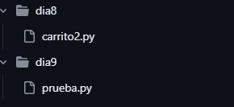

# PYTHON 
En este repositorio encontrarás 10 carpetas con trabajos hechos con el lenguaje python.Cada carpeta cuenta con el archivo Python donde se realizaron trabajos para el avance del curso.

python
main.py

## División de Carpetas 

|Carpetas|Número de Trabajos|
|--|--|
|dia1| 1 trabajo|
|dia2| 3 trabajos|
|dia3| 1 trabajo|
|dia4| 1 trabajo|
|dia6| 2 trabajos|
|dia7| 1 trabajo|
|dia8| 1 trabajo|
|dia9| 1trabajo|
|dia10| 1 trabajo|

# Instalación 

1. Clona el repositorio: Utiliza el comando "git clone" seguido de la URL del repositorio para clonar el proyecto en tu computadora local.

2. Abre la carpeta del proyecto: Navega a la carpeta donde se clonó el proyecto y ábrela en tu editor de código favorito.

3. Abre el archivo Python: Busca el archivo Python principal (usualmente "main.py") y ejecútalo en la terminal.

## Explicación 

Se realizaron trabajos como:

* Operadores lógicos
* Funciones

* Diccionarios 

* Listas

### Estructura

